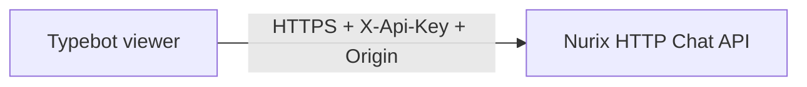

# Nurix HTTP Chat Forge block

This package connects Typebot directly to the Nurix HTTP Chat API. All requests
run in the Typebot server process, and the API key remains inside encrypted
Forge credentials.



## Conversation lifecycle

Use one Nurix session for one Typebot conversation:

1. **Start Session** creates a session and returns `Session ID`, the current
   `Conversation ID`, and an optional greeting.
2. **Send Message** sends one user turn and waits for the complete response.
   Render every returned message in order and retain the latest conversation
   ID.
3. **End Session** closes the session when the conversation finishes, expires
   locally, or transfers to another support channel.

Only one message may be in flight for a session. A second overlapping request
returns HTTP 409.

## Credentials

Create one encrypted **Nurix Chat account** credential containing:

- the Nurix API key;
- the regional HTTPS base URL;
- the account ID;
- the configured channel name, normally `CHAT_WIDGET`; and
- the exact HTTPS Origin allowlisted by Nurix.

The current server integration requires CAPTCHA to be disabled for the Nurix
deployment.

## Response handling

- `COMPLETED`: render every returned message.
- `NO_REPLY`: render nothing and keep the session open.
- `HUMAN_TRANSFERRED`: stop sending turns to Nurix.
- `ROUTED_TO_JOURNEY`: render nothing; the journey responds through its own
  channel.
- `Is Transfer = true`: at least one message returned by the current Send
  response has `is_transfer = true`. This is the raw immediate-turn signal.
- `Human Transfer Requested = true`: either the top-level
  `human_transfer_requested` field is true or `Is Transfer` is true. This
  normalized output keeps existing workflow branches compatible with both
  Nurix response styles.

`Messages JSON` retains the individual `isTransfer` value for every returned
message when a workflow needs per-message detail. Use `Is Transfer` when the
workflow must distinguish a current-message signal from the normalized
compatibility output. An absent transfer field defaults to false, while a field
that is present must still be a boolean.

The `Request Succeeded`, `HTTP Status`, `Error Code`, `Error Detail`, and
`Retryable` mappings are available for explicit failure branches. The block
never retries automatically. Because message requests are not deduplicated,
retry only when the returned classification permits it, and limit a server
error retry to one attempt.

## Runtime safeguards

- 35-second total request deadline;
- HTTPS-only, Nurix-owned API hosts;
- no redirect following;
- path-segment encoding for account, channel, and session identifiers;
- 64 KiB response limit;
- strict required-field and response-type validation; and
- sanitized logs that do not include credentials or message content.

Run package validation from the Typebot repository root:

```sh
bunx nx test '@typebot.io/nurix-chat-block'
bunx nx typecheck '@typebot.io/nurix-chat-block'
```
